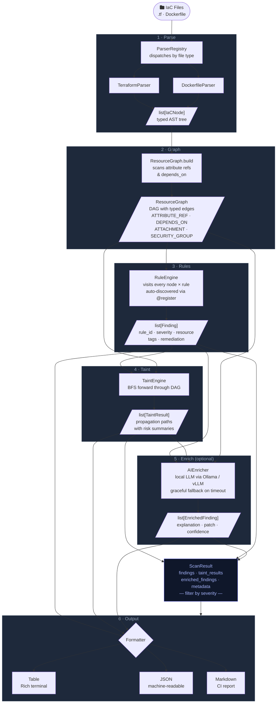

# CloudSpill

**Static Application Security Testing Engine for Infrastructure-as-Code**

CloudSpill parses Terraform configurations and Dockerfiles into a typed AST, builds a directed acyclic graph of resource dependencies, and performs taint analysis to trace how security misconfigurations propagate through your infrastructure.

It is not a regex scanner. It reasons about structure.

[](https://www.python.org/)


## Quickstart

```bash
git clone https://github.com/SamiAdamMoughli/CloudSpill
cd CloudSpill

python3 -m venv .venv
source .venv/bin/activate

pip install -e ".[dev]"

# Run the test suite
pytest

# Try it on the bundled fixtures
cloudspill cloudspill/tests/fixtures/ --show-taint
```

## Usage

```bash
# Scan a directory or single file
cloudspill ./infrastructure/
cloudspill main.tf

# Output formats
cloudspill ./infra --format table       # Rich table (default)
cloudspill ./infra --format json        # Machine-readable
cloudspill ./infra --format markdown    # Report file

# Filter by severity
cloudspill ./infra --min-severity HIGH

# Show taint propagation paths
cloudspill ./infra --show-taint

# Target specific rule sets
cloudspill ./infra --rules s3,iam

# Exit code 1 if findings at or above this severity (CI/CD)
cloudspill ./infra --fail-on CRITICAL
```

## AI-Enhanced Analysis (in development)

CloudSpill can enrich findings with LLM-generated explanations and remediation patches using a local reasoning model (Qwen3.6-35B-A3B or Gemma 4 31B QAT) served via Ollama, vLLM, or LM Studio.

> ⚠️ This feature is still under active development. The `--ai` flag is functional but the prompt design, output formatting, and model integration are subject to change.

```bash
# Start your local model server first, then:
cloudspill ./infra --ai --show-taint
cloudspill ./infra --ai --model qwen3.6-35b-a3b
cloudspill ./infra --ai --ai-url http://localhost:1234/v1
```

If no inference server is reachable, CloudSpill falls back gracefully and continues without AI enrichment.

## Architecture



See [ARCHITECTURE.md](ARCHITECTURE.md) for the full pipeline design, data model, and design rationale.

## Development

```bash
# Run tests
pytest cloudspill/tests/

# Type checking
mypy --strict cloudspill/

# Linting
pylint cloudspill/ --ignore=tests
black --check cloudspill/
isort --check --profile black cloudspill/

# Security audit
bandit -r cloudspill/
```

## Ethical Use

CloudSpill is a static analysis tool for infrastructure code you own or have explicit written authorisation to audit. It performs no active scanning, no network connections, and no live infrastructure interaction. All analysis is performed on configuration files at rest.

## License

[MIT](LICENSE)