# CloudSpill

**Static Application Security Testing Engine for Infrastructure-as-Code**

[](https://www.python.org/)
[](LICENSE)
[](tests/)

CloudSpill parses Terraform configurations into a typed AST, builds a directed acyclic graph of resource dependencies, runs structural security rules, and traces how misconfigurations propagate through your infrastructure via taint analysis.

It is not a regex scanner. It reasons about structure.

---

## Features

- **Structural analysis** — typed AST over Terraform resources; no regex
- **Resource graph** — directed acyclic graph of references, attachments, and `depends_on` edges
- **Taint engine** — BFS propagation traces how a single misconfiguration reaches downstream resources
- **130+ AWS rules** — across 14 services: S3, IAM, EC2/EBS/SSM, RDS, VPC, KMS, Lambda, DynamoDB, ECS/Fargate/ECR, CloudFront, API Gateway, CloudTrail, SNS/SQS, Secrets Manager, GuardDuty, Organizations
- **AI enrichment** — optional LLM analysis via Ollama, OpenAI, Anthropic, or Google Gemini
- **Graph visualisation** — `--graph` outputs a Mermaid diagram with severity-coloured nodes and taint overlays
- **Multiple output formats** — Rich terminal table, JSON, Markdown
- **CI/CD integration** — `--fail-on CRITICAL` exits with code 1 on matching severity

---

## Quickstart

```bash
git clone https://github.com/SamiAdamMoughli/CloudSpill
cd CloudSpill

python3 -m venv .venv
source .venv/bin/activate
pip install -e ".[dev]"

# Run the test suite
pytest

# Scan the bundled vulnerable fixtures
cloudspill tests/fixtures/examples/vulnerable-aws-stack/ --show-taint
```

---

## Usage

```bash
# Scan a directory or single file
cloudspill ./infrastructure/
cloudspill main.tf

# Filter by severity
cloudspill ./infra --min-severity HIGH

# Target specific rule sets (comma-separated, by rule-id prefix)
cloudspill ./infra --rules s3,iam,ec2
cloudspill ./infra --rules vpc,kms          # VPC + KMS rules only

# Output formats
cloudspill ./infra --format table           # Rich table (default)
cloudspill ./infra --format json            # Machine-readable
cloudspill ./infra --format markdown        # Report file

# Show taint propagation paths
cloudspill ./infra --show-taint

# Visualise the resource graph (paste into mermaid.live or GitHub markdown)
cloudspill ./infra --graph
cloudspill ./infra --graph --graph-file diagram.md

# Exit code 1 if findings at or above this severity (CI/CD)
cloudspill ./infra --fail-on CRITICAL
```

---

## AI Enrichment

CloudSpill can enrich findings with LLM-generated explanations and remediation patches. Four providers are supported.

### Local (Ollama / vLLM / LM Studio)

```bash
# Start Ollama first, then:
cloudspill ./infra --ai --model qwen3:8b
cloudspill ./infra --ai --model gemma3:12b --ai-url http://localhost:1234/v1
```

### OpenAI

```bash
export CLOUDSPILL_API_KEY=sk-...
cloudspill ./infra --ai --provider openai --model gpt-4o
```

### Anthropic

```bash
export CLOUDSPILL_API_KEY=sk-ant-...
cloudspill ./infra --ai --provider anthropic --model claude-haiku-4-5-20251001
```

### Google Gemini

```bash
export CLOUDSPILL_API_KEY=...
cloudspill ./infra --ai --provider google --model gemini-3.5-flash

# Free-tier rate limiting (10 RPM): pace requests to avoid 429s
cloudspill ./infra --ai --provider google --ai-rpm 9
```

### Prompt modes

| Mode | Description |
|---|---|
| `explain` | Plain-English risk explanation covering what is wrong and the blast radius (default) |
| `fix` | Minimal copy-paste Terraform remediation snippet |
| `triage` | True-positive / false-positive verdict with evidence from source context |

```bash
cloudspill ./infra --ai --provider google --prompt-mode fix
cloudspill ./infra --ai --provider anthropic --prompt-mode triage
```

If no inference server is reachable, CloudSpill falls back gracefully and continues without AI enrichment.

---

## Architecture

```mermaid
flowchart TD
    A([fa:fa-folder PATH\n.tf · Dockerfile]) --> CLI

    subgraph DRIVER ["cli.py → ScanContext"]
        CLI["scan() click command\nbuilds ScanConfig\n(rule_sets · min_severity · fail_on)"]
        CLI --> COL["_collect_files\nrglob *.tf + Dockerfile*"]
        COL --> CTX["ScanContext.run(paths)"]
    end

    subgraph PARSE ["1 · Parse  (ParserRegistry.parse_all)"]
        CTX --> B{"parser.can_parse?"}
        B -->|*.tf| B1["TerraformParser\nhcl2.load → IaCNode tree"]
        B -->|Dockerfile| B2["DockerfileParser\ninstructions → IaCNode"]
        B -->|neither| BSKIP["skip"]
        B1 & B2 --> PERR["parse failures →\nParseError list\n(scan keeps going)"]
        B1 & B2 --> C[/"list[IaCNode]\ntyped AST + children"/]
    end

    subgraph RESOLVE ["2 · Resolve  (ConfigResolver.resolve) — per root dir"]
        C --> RV1["build _Scope:\nvariable defaults\n+ *.auto.tfvars / terraform.tfvars"]
        RV1 --> RV2["evaluate locals\n(iterative, cross-referencing)"]
        RV2 --> RV3["expand local module blocks\n(./ ../ sources, seeded by args)"]
        RV3 --> RV4["rewrite attrs: evaluate\n#36;{...} interpolations via hcl_expr\n(unresolved left as-is)"]
        RV4 --> C2[/"list[IaCNode]\nliterals substituted"/]
    end

    subgraph GRAPH ["3 · Graph  (ResourceGraph.build)"]
        C2 --> D1["add every node"]
        D1 --> D2["scan attrs for refs\n#36;{type.name.attr} + bare\n+ depends_on"]
        D2 --> D3["classify edge kind"]
        D3 --> E[/"ResourceGraph (DAG)\nATTRIBUTE_REF · DEPENDS_ON\nATTACHMENT · SECURITY_GROUP\nMODULE_OUTPUT"/]
    end

    subgraph RULES ["4 · Rules  (RuleEngine.evaluate)"]
        REG["RuleRegistry\npkgutil.walk_packages →\n@register classes\n(filter by ID prefix)"]
        E --> F["visit node × rule,\nrecurse children,\ndedup by (rule_id, resource)"]
        REG --> F

        subgraph AWS ["aws/ · 137 rules across 14 services"]
            direction LR
            R1["s3 · iam · ec2/ebs/ssm\nrds · vpc · kms · lambda\ndynamodb · ecs_fargate/ecr"]
            R2["cloudfront · api_gateway\ncloudtrail · sns_sqs\nsecrets_manager · guardduty\norganizations"]
            RU["utils/\nhcl.py · policy.py\n(+ per-service helpers)"]
            RU -.-> R1 & R2
        end

        F --> AWS
        AWS --> G[/"list[Finding]\nrule_id · severity · resource\ntags · remediation"/]
    end

    subgraph TAINT ["5 · Taint  (TaintEngine.propagate)"]
        G --> H["per finding: BFS forward\nthrough incoming() edges\n(referencing resources)"]
        E --> H
        H --> I[/"list[TaintResult]\npaths + risk summaries\n(only findings w/ downstream)"/]
    end

    subgraph ENRICH ["6 · Enrich  (optional, --ai)"]
        G & I --> J["AIEnricher\nThreadPool(5) + opt rate-limit\nPromptLoader[explain/fix/triage]"]
        J --> PROV["make_provider:\nlocal · openai · anthropic · google"]
        PROV --> J
        J --> K[/"list[EnrichedFinding]\nexplanation · patch · confidence\n(degrades on provider error)"/]
    end

    SR["ScanResult\nfindings · taint_results · graph\nenriched_findings · metadata"]
    G & I & K & E --> SR
    SR --> FILT["result.filter(min_severity)"]

    subgraph OUT ["7 · Output"]
        FILT --> L{"--format / --graph"}
        L --> L1["TableFormatter\n(Rich terminal)"]
        L --> L2["JsonFormatter"]
        L --> L3["MarkdownFormatter\n(CI report)"]
        L --> L4["MermaidGraphFormatter\n(--graph)"]
    end
    FILT --> GATE{"--fail-on hit?\nexit 1"}

    style DRIVER fill:#0f172a,stroke:#6366f1,color:#a5b4fc
    style PARSE fill:#1e293b,stroke:#334155,color:#94a3b8
    style RESOLVE fill:#1e293b,stroke:#334155,color:#94a3b8
    style GRAPH fill:#1e293b,stroke:#334155,color:#94a3b8
    style RULES fill:#1e293b,stroke:#334155,color:#94a3b8
    style AWS fill:#0f2a1e,stroke:#166534,color:#86efac
    style TAINT fill:#1e293b,stroke:#334155,color:#94a3b8
    style ENRICH fill:#1e293b,stroke:#334155,color:#94a3b8
    style OUT fill:#1e293b,stroke:#334155,color:#94a3b8
    style SR fill:#0f172a,stroke:#6366f1,color:#a5b4fc
    style RU fill:#0f172a,stroke:#6366f1,color:#a5b4fc
```



---

## Development

```bash
# Install with dev dependencies
pip install -e ".[dev]"

# Run the full test suite (433 tests)
pytest

# Type checking
mypy --strict cloudspill/

# Linting and formatting
pylint cloudspill/ --ignore=tests
black --check cloudspill/
isort --check --profile black cloudspill/

# Security audit
bandit -r cloudspill/ -c pyproject.toml
```

---

## Contributing

See [CONTRIBUTING.md](CONTRIBUTING.md) for setup instructions, coding standards, and how to add new rules, parsers, or providers.

Found a security issue in CloudSpill itself? Please follow the private disclosure process in [SECURITY.md](SECURITY.md) — don't open a public issue.

---

## Security

To report a vulnerability, see [SECURITY.md](SECURITY.md).

---

## Ethical Use

CloudSpill is a static analysis tool for infrastructure code you own or have explicit written authorisation to audit. It performs no active scanning, no network connections to target infrastructure, and no live infrastructure interaction. All analysis is performed on configuration files at rest.

---

## License

[MIT](LICENSE)
