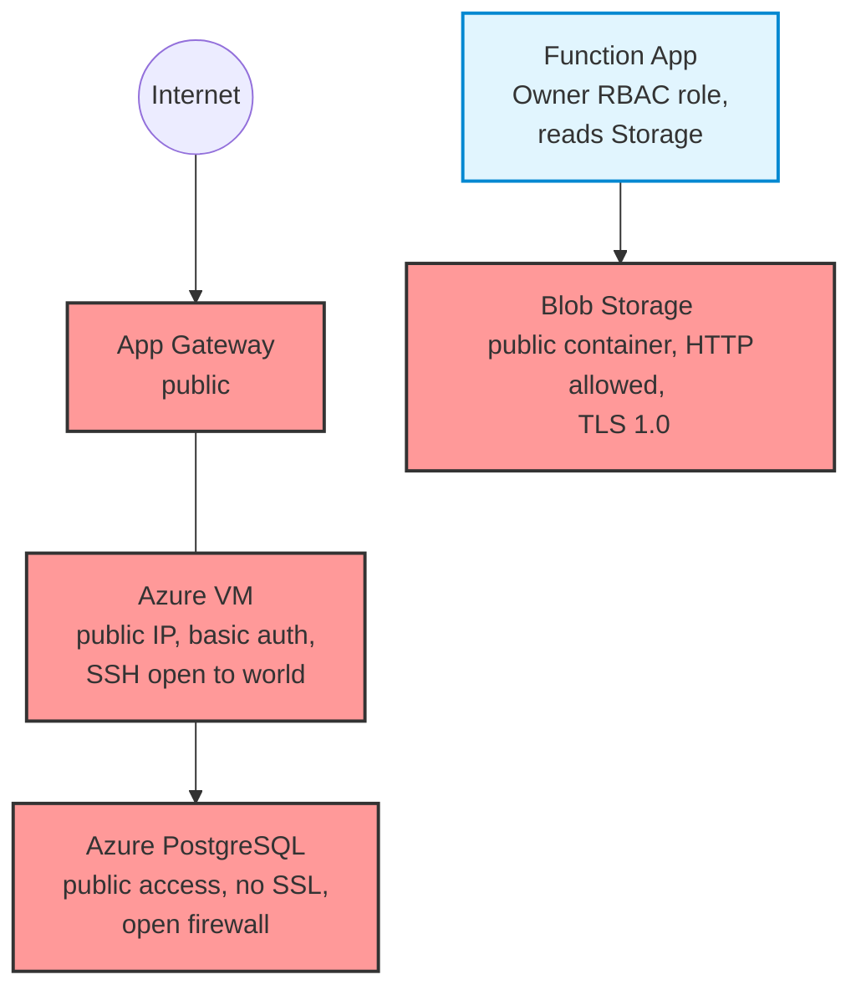

Here is the entire markdown document ready to copy and paste:

```markdown
# Vulnerable Azure Stack — CloudSpill Demo

A deliberately misconfigured Azure infrastructure for demonstrating CloudSpill's static analysis and taint propagation capabilities.
**DO NOT deploy this infrastructure.** Every file contains intentional security misconfigurations for testing purposes.

## Architecture



## Expected Findings

Run `cloudspill . --show-taint` from this directory to see:

* ~30+ findings across Azure Storage, RBAC, VM, PostgreSQL, and Docker.
* Multiple taint propagation chains (Storage -> Function App -> App Gateway).
* Cross-file resource dependency tracking.

## Files

| File | What's wrong |
| --- | --- |
| `storage.tf` | Public containers, HTTP allowed, TLS 1.0, logging disabled |
| `rbac.tf` | Subscription-level Owner assignment, overpermissive managed identity |
| `nsg.tf` | SSH (22) and all ports open to the Internet (`*`) |
| `vm.tf` | Public IP attached, password auth enabled (no SSH keys), no boot diagnostics |
| `db.tf` | Public network access enabled, SSL enforcement disabled, firewall allows `0.0.0.0` |
| `function.tf` | References tainted Storage + overpermissive Managed Identity |
| `Dockerfile` | Root user, `latest` tag, secrets in ENV, `ADD` instead of `COPY` |

```