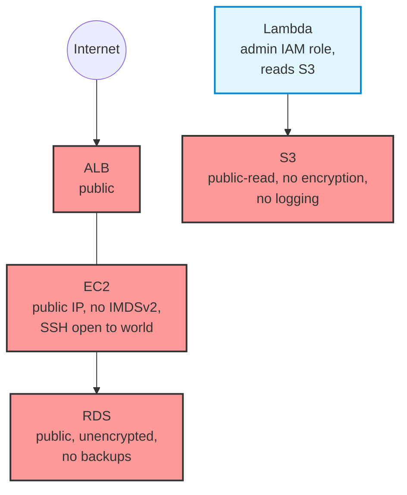

# Vulnerable AWS Stack — CloudSpill Demo

A deliberately misconfigured AWS infrastructure for demonstrating CloudSpill's
static analysis and taint propagation capabilities.

**DO NOT deploy this infrastructure.** Every file contains intentional security
misconfigurations for testing purposes.

## Architecture

## Expected Findings

Run `cloudspill . --show-taint` from this directory to see:
- ~30+ findings across S3, IAM, EC2, RDS, Docker
- Multiple taint propagation chains
- Cross-file resource dependency tracking

## Files

| File | What's wrong |
|---|---|
| `s3.tf` | Public buckets, no encryption, no logging, no versioning |
| `iam.tf` | Wildcard actions, admin access, inline policies, no MFA |
| `security_groups.tf` | SSH open to world, all ports open |
| `ec2.tf` | Public IP, no IMDSv2 |
| `rds.tf` | Public database, no encryption, no deletion protection |
| `lambda.tf` | References tainted S3 + overpermissive IAM role |
| `Dockerfile` | Root user, latest tag, secrets in ENV, ADD instead of COPY |